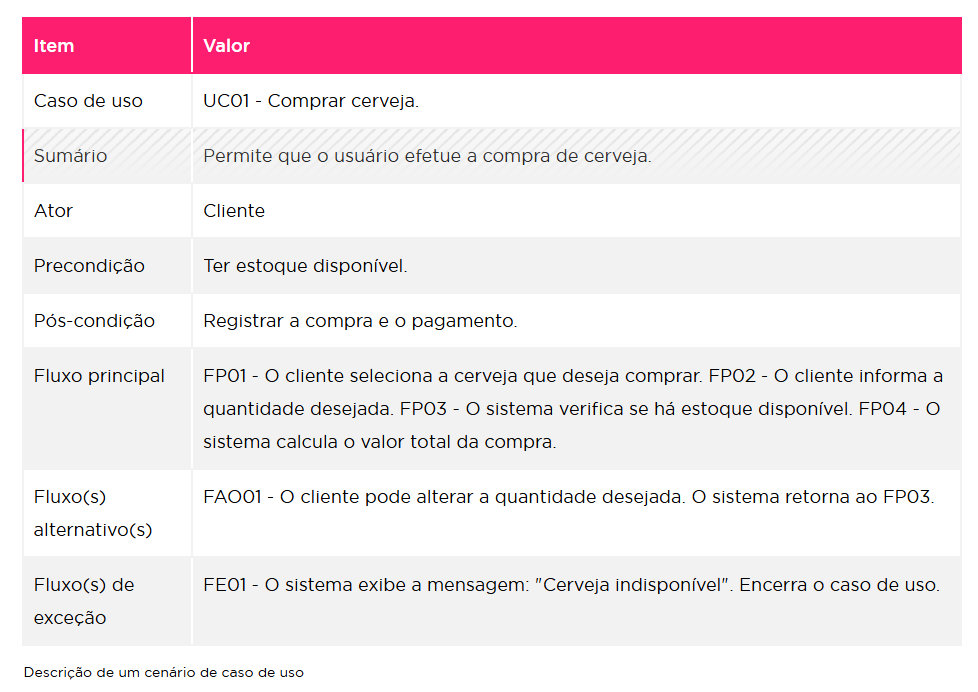
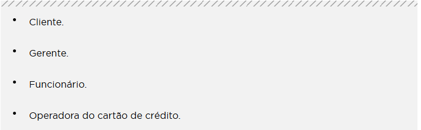
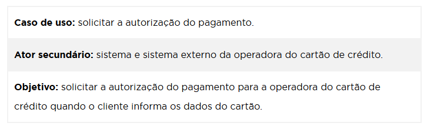
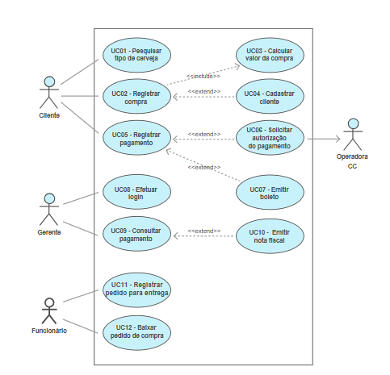

> ## Fase I - Protótipo do Sistema

- Objetivo do projeto: 
    - aplicativo focados em pequenos empreendedores. Efetua cobrança de dividas autoaticamente dos compradores. 

- Etapas - conteúdos abordados:  
    - Fase I - Story Mapping do projeto

    - Fase II - Protótipo do programa: interface do aplicativo criado com Figma. 
        - Criar Documentação e Diagramas de casos de uso na forma de wireframes ou desenhos para definir como as telas do sistema serão. 
        - 
    
---
    Ferramentas: 
        > FIGMA 

> ## Fase II - Diagramas e Casos de Usos 

- User Case (Caso de Uso) 
    - conceito: descreve como um usuário (ou "ator") interage com o sistema para alcançar um objetivo específico/realizar uma tarefa. (o caso de uso não representa um passo ou uma etapa em uma funcionalidade do sistema)

    [Objetivo Casos de Usos](image.png)

    - descrição de um cenário de caso de Uso: 
    
        
    - Elementos: 
        - Ator: ator corresponde a um papel representado por algo ou alguém,sendo qualquer  elemento  externo  ao sistema (quem pode interagir com o sistema). 
        - Fronteira: Constitui-sedos casos de uso que compõem o sistema, ou seja, é o limite do sistema
        - Relacionamentos: 
            - comunicação - indica  com  qual  caso  de  uso  um determinado ator troca informações. É representada por uma linha sólida
            - inclusão - conecta o caso de uso base ao caso de uso incluído. representadas por uma linha tracejada e a seta aponta para o caso de uso incluído e o estereótipo << INCLUDE >> 
            - extensão - relacionamento  que  identifica  um  processo que pode  ou  não  ser executado. representadas por uma linha tracejada e a seta aponta para o caso de uso que utiliza o caso de uso estendido e o estereótipo << EXTEND >>
            - generalização - ermite que um caso de uso ou ator herde características de outro mais genérico, chamado de caso de uso ou ator-base. 
  

    - construção Diagrama User Case | passo-a-passo
        1) Identificar os atores 
        
        2) Identficar os casos de uso 
        
        3) Identificar os relacionamentos entre os atores e user cases 
        4) Identificar relacionamentos entre user case, se houver
        5) Identificar os relacionamentos entre os atores, se houver. 
        

  
o conceito de modelo de caso de uso;  
os elementos de um modelo de caso de uso;  
construção do Diagrama de Caso de Uso; eo estudo de caso.  

